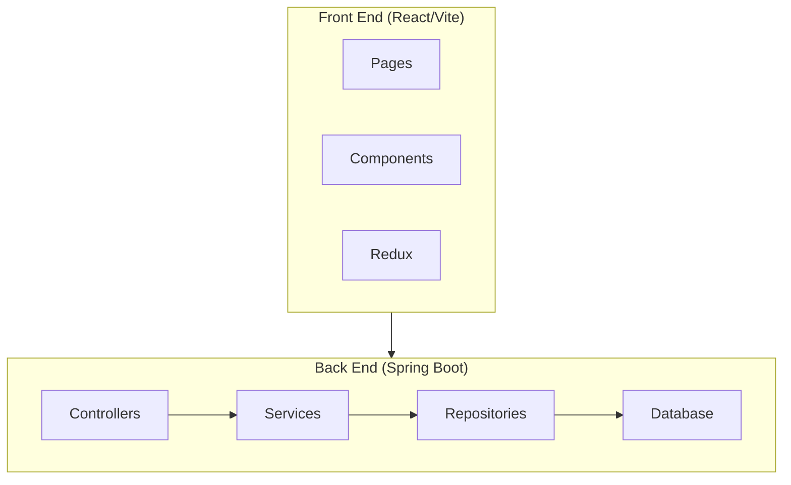

# Social Media Application

This is a full-stack social media application built with a modern technology stack, featuring a reactive frontend and a robust backend. It includes features like user authentication, post creation, social interactions (likes, comments, follows), and real-time chat.

## Features

- **User Authentication:** Secure user registration and login using JWT.
- **Create & Manage Posts:** Users can create, view, and delete their own posts.
- **Social Interaction:** Like posts, comment on posts, and follow/unfollow other users.
- **Real-time Chat:** Engage in one-on-one conversations with other users in real-time.
- **User Profiles:** View and edit user profiles.
- **Suggestions:** Get suggestions for users to follow.

## Screenshots

*Add your screenshots here. You can use markdown to display them.*

_Example:_
``

## Tech Stack

### Frontend

- **React:** A JavaScript library for building user interfaces.
- **Vite:** A fast build tool for modern web development.
- **Redux:** For predictable state management.
- **Shadcn/UI & Tailwind CSS:** For a modern and responsive component library and styling.
- **Axios:** For making HTTP requests to the backend.
- **StompJS & SockJS:** For WebSocket communication for the real-time chat feature.

### Backend

- **Java & Spring Boot:** For building the robust and scalable RESTful API.
- **Spring Security:** For handling authentication and authorization with JWT.
- **Spring Data JPA & Hibernate:** For object-relational mapping and data persistence.
- **Spring WebSocket:** For real-time communication.
- **MySQL/PostgreSQL (or H2):** As the relational database.
- **Maven:** For dependency management.

## Architecture

The application is designed with a classic client-server architecture:

-   **Frontend:** A single-page application (SPA) built with React that consumes the backend API. It handles all the UI and client-side state.
-   **Backend:** A Spring Boot application that exposes a REST API for standard operations and uses WebSockets for real-time features. It follows a layered architecture (Controller -> Service -> Repository).



## Prerequisites

Before you begin, ensure you have the following installed:

-   [Java JDK 17](https://www.oracle.com/java/technologies/javase/jdk17-archive-downloads.html) or later
-   [Maven](https://maven.apache.org/download.cgi)
-   [Node.js](https://nodejs.org/en/) (which includes npm)
-   A running instance of a relational database (e.g., MySQL, PostgreSQL).

## Getting Started

### 1. Backend Setup

1.  **Clone the repository:**
    ```bash
    git clone <repository-url>
    cd <repository-folder>/SocialMedia
    ```

2.  **Configure the database:**
    -   Open `src/main/resources/application.properties`.
    -   Update the `spring.datasource.url`, `spring.datasource.username`, and `spring.datasource.password` properties to match your database configuration.
    -   Set `spring.jpa.hibernate.ddl-auto` to `update` or `create` for the first run to automatically generate the database schema.

3.  **Run the application:**
    ```bash
    mvn spring-boot:run
    ```
    The backend server will start on `http://localhost:8080`.

### 2. Frontend Setup

1.  **Navigate to the frontend directory:**
    ```bash
    cd ../Front End/my-shadcn-app
    ```

2.  **Install dependencies:**
    ```bash
    npm install
    ```

3.  **Run the application:**
    ```bash
    npm run dev
    ```
    The frontend development server will start on `http://localhost:5173`.

4.  **Open your browser** and navigate to `http://localhost:5173` to see the application in action.

## Project Structure

The repository is organized into two main parts:

-   `SocialMedia/`: The Spring Boot backend application.
    -   `src/main/java`: Contains all the Java source code, organized by feature (controller, service, repository, model).
    -   `src/main/resources`: Contains configuration files like `application.properties`.
-   `Front End/my-shadcn-app/`: The React frontend application.
    -   `src/`: Contains all the frontend source code.
        -   `pages/`: Top-level page components.
        -   `components/`: Reusable UI components.
        -   `redux/`: Redux store, actions, and reducers.

---

Thank you for checking out the project! 